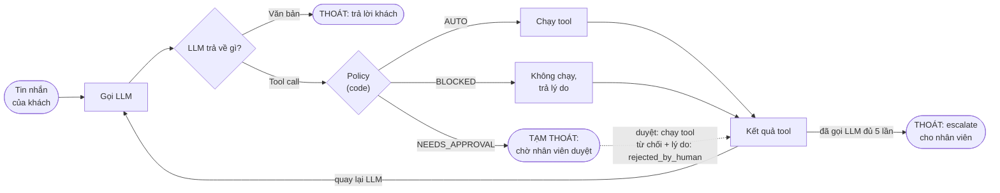
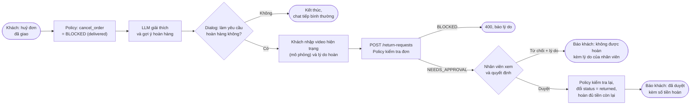

# Order Support Chatbot — Tài liệu thiết kế

Chatbot hỗ trợ đơn hàng mô phỏng một sàn thương mại điện tử: nhận câu hỏi về đơn hàng và tự tra cứu thông tin; **mọi thao tác động tới tiền (huỷ đơn, hoàn tiền) luôn cần con người duyệt trước khi chạy, bất kể số tiền**; yêu cầu vượt quyền thì escalate cho người. Python + FastAPI + Gemini API, kèm giao diện chat chạy trên trình duyệt.

## 1. Phạm vi

**Có làm**
- REST API cho hội thoại: tạo phiên, gửi tin nhắn, duyệt/từ chối hành động (từ chối phải kèm lý do), gửi yêu cầu hoàn hàng.
- Giao diện chat tối giản (một trang tĩnh, nền đen); người dùng đóng cả vai khách hàng và nhân viên CSKH (nút Duyệt / Từ chối hiện ngay trong chat).
- Duyệt bởi con người (human-in-the-loop) qua API, không chặn thread. Khi nhân viên từ chối, lý do được gửi lại cho khách.
- Luồng hoàn hàng: đơn đã giao không huỷ được thì khách được mời làm yêu cầu hoàn hàng (nhập video hiện trạng và lý do), nhân viên duyệt hoặc từ chối.
- Guardrails nằm trong code (không dựa vào prompt).
- Xử lý input sai/thiếu một cách an toàn.

**Không làm** (để giữ đơn giản): xác thực khách hàng/nhân viên, database, lưu phiên qua lần khởi động lại, nhiều process, streaming token, upload video thật (video của yêu cầu hoàn hàng chỉ là thông tin nhập tay, mô phỏng).

**Đã bỏ**: chế độ CLI và lệnh `scan` (quét toàn bộ đơn, sinh báo cáo). `detect_issues` vẫn còn, dùng cho tool `get_order`.

## 2. Luồng hoạt động



Cách đọc:

- **Quay lại LLM**: mọi tool call (chạy, bị chặn, hoặc đã được duyệt/từ chối) đều cho ra một "kết quả tool". Kết quả này được đưa lại cho LLM để nó gọi thêm tool hoặc viết câu trả lời.
- **Thoát vòng lặp**: LLM trả văn bản (câu trả lời cuối), hoặc đã gọi LLM đủ 5 lần thì hệ thống tự escalate.
- **Tạm thoát**: tool `NEEDS_APPROVAL` dừng lượt và trả `status = pending_approval`. Sau khi nhân viên bấm Duyệt hoặc Từ chối (kèm lý do), lượt chạy tiếp và vào lại vòng lặp; bộ đếm 5 lần không bị reset.
- **Lỗi** (API Gemini, mạng, quota...) ở bất kỳ bước nào: lịch sử về checkpoint, khách nhận thông báo lỗi, phiên dùng tiếp được.

Vòng lặp tool-calling do **mình tự điều khiển** (tắt automatic function calling của SDK) để chèn policy layer vào giữa. Giới hạn tối đa 5 lượt gọi Gemini cho mỗi tin nhắn để tránh vòng lặp vô hạn.

### Tạm dừng và tiếp tục khi chờ duyệt

Trên CLI trước đây, bước duyệt là `input()` chặn luồng. Với API, một request không thể chờ nhân viên, nên lượt hội thoại được tách thành các bước có thể dừng:

- Agent giữ trong phiên: danh sách tool call Gemini đề xuất ở bước hiện tại, các kết quả đã có (theo đúng thứ tự), và yêu cầu đang chờ duyệt.
- Gặp tool `NEEDS_APPROVAL`: dừng, `chat` trả `TurnResult(status="pending_approval")`.
- `resolve_approval(approved, reason)`: xử lý tool đó (chạy hoặc từ chối), chạy nốt các tool còn lại của bước (có thể lại dừng nếu có tool khác cần duyệt), rồi gọi Gemini tiếp.
- Khi duyệt, policy vẫn được **đánh giá lại** trên dữ liệu hiện tại để chắc chắn yêu cầu còn hợp lệ (phòng thủ: dữ liệu đơn là riêng của phiên, nên trong lúc chờ không phiên nào khác đổi được đơn này).
- Lỗi ở bất kỳ bước nào: lịch sử về trước lượt đó, xoá trạng thái chờ, phiên dùng tiếp được.

### Lý do khi nhân viên từ chối

- **UI**: bấm "Từ chối" thì thẻ duyệt mở ô nhập lý do (bắt buộc, tối đa 500 ký tự) cùng hai nút "Gửi từ chối" và "Quay lại". Chỉ khi bấm "Gửi từ chối" mới gọi API; "Quay lại" đưa thẻ về hai nút Duyệt / Từ chối.
- **API**: `POST /approval` nhận `{approved, reason}`. `approved = false` mà `reason` thiếu, rỗng (chỉ khoảng trắng) hoặc quá 500 ký tự thì trả 400, lượt vẫn đang chờ duyệt. `approved = true` thì bỏ qua `reason`.
- **Agent**: lý do đưa vào kết quả tool `{status: rejected_by_human, reason: <lý do của nhân viên>}`. System prompt yêu cầu LLM báo khách yêu cầu không được duyệt và nêu đúng lý do đó, không bịa thêm.
- Áp dụng cho mọi thao tác cần duyệt do LLM đề xuất (huỷ đơn, hoàn tiền). Yêu cầu hoàn hàng cũng dùng ô lý do này nhưng thông báo cho khách bằng mẫu cố định (xem bên dưới).

### Luồng hoàn hàng



- **Mời hoàn hàng**: do code quyết định, không do LLM. Nếu trong lượt có `cancel_order` bị BLOCKED vì đơn `delivered`, và đơn đủ điều kiện hoàn hàng theo policy, thì kết quả trả về có `offer_return = <mã đơn>` và UI hiện dialog dưới câu trả lời. Câu trả lời của LLM có gợi ý hoàn hàng nhờ lý do BLOCKED chứa lời gợi ý (xem mục 7) và một dòng trong system prompt.
- **Dialog 1**: "Bạn có muốn làm yêu cầu hoàn hàng cho đơn X không?" với hai nút Có / Không. Không chỉ đóng dialog, không gửi gì lên server. Trong lúc dialog mở, ô nhập tin nhắn bị khoá cho đến khi khách chọn.
- **Dialog 2** (khi chọn Có): hai ô bắt buộc, **video hiện trạng sản phẩm** (tên file hoặc đường dẫn, tối đa 200 ký tự; mô phỏng, không upload, không kiểm tra) và **lý do hoàn hàng** (tối đa 500 ký tự), cùng nút Gửi và Huỷ. Gửi thì gọi `POST /return-requests`.
- **Không đi qua LLM**: hoàn hàng không phải tool của LLM (không nằm trong danh sách tool khai báo cho Gemini), nên LLM không thể tự tạo hay tự duyệt. Vòng lặp 5 lần gọi LLM không liên quan.
- **Chờ nhân viên**: dùng cùng cơ chế `pending` và `POST /approval`. Thẻ duyệt hiển thị mã đơn, số tiền sẽ hoàn, video và lý do của khách. Từ chối bắt buộc nhập lý do như trên. Trong lúc chờ, tin nhắn mới hoặc yêu cầu hoàn hàng mới nhận 409.
- **Khi duyệt**: policy đánh giá lại trên dữ liệu hiện tại (đơn có thể đã đổi). Nếu còn hợp lệ thì đơn chuyển sang `returned`, hoàn toàn bộ số tiền còn lại của đơn (`payment_status = refunded`) và lưu video, lý do vào đơn. Nếu không còn hợp lệ thì không chạy và báo khách không thực hiện được vì đơn đã thay đổi.
- **Thông báo cho khách**: mẫu cố định trong code, không gọi Gemini, vẫn kết thúc bằng 3 dòng Tóm tắt / Đề xuất / Trạng thái để API tách trường như thường. Duyệt thì nêu số tiền hoàn; từ chối thì nêu nguyên văn lý do của nhân viên. Kết quả được ghi vào lịch sử (một message `user` mô tả yêu cầu và một message `model` là thông báo) để LLM nắm ngữ cảnh khi khách hỏi tiếp.
- **Lỗi**: lịch sử về trước yêu cầu hoàn hàng, xoá trạng thái chờ, phiên dùng tiếp được, như các lượt khác.

## 3. Cấu trúc file

```
├── src/
│   ├── main.py            # khởi động server (uvicorn)
│   ├── api.py             # REST API, quản lý phiên, phục vụ UI
│   ├── agent.py           # Vòng lặp Gemini + gọi policy + tạm dừng/tiếp tục khi chờ duyệt + luồng hoàn hàng
│   ├── tools.py           # dữ liệu mẫu + tạo bản sao đơn cho mỗi phiên; get_order, cancel_order, issue_refund, escalate_to_human; return_order (nội bộ, không cho LLM gọi)
│   ├── policy.py          # Luật guardrail (kể cả evaluate_return) + hàm detect_issues (thuần code, không LLM)
│   ├── agent_trace.py     # In từng bước của agent ra console backend (không ghi file)
│   └── static/index.html  # Giao diện chat
├── data/orders.json       # Dữ liệu mẫu
├── requirements.txt       # google-genai, python-dotenv, fastapi, uvicorn
├── .env.example           # GEMINI_API_KEY=, GEMINI_MODEL=
├── README.md
└── DESIGN.md
```

Chạy bằng `python src/main.py` từ thư mục gốc, mở `http://127.0.0.1:8000`.

## 4. API

| Method | Đường dẫn | Mô tả |
|---|---|---|
| `POST` | `/api/sessions` | Tạo phiên, trả `session_id` |
| `POST` | `/api/sessions/{id}/messages` | Gửi tin nhắn của khách |
| `POST` | `/api/sessions/{id}/approval` | Nhân viên duyệt / từ chối, body `{approved, reason}` (`reason` bắt buộc khi từ chối) |
| `POST` | `/api/sessions/{id}/return-requests` | Khách gửi yêu cầu hoàn hàng, body `{order_id, video, reason}`; trả `pending_approval` |
| `GET` | `/api/health` | Kiểm tra server |

`messages`, `approval` và `return-requests` trả cùng một dạng: `status` (`reply` hoặc `pending_approval`), `reply` (toàn văn), `body` (bỏ 3 dòng cuối), `summary` / `suggestion` / `case_status` (tách từ 3 dòng cuối), `approval` (hành động chờ duyệt, nếu có), `tool_events` (các tool đã gọi cùng quyết định của policy; UI hiện tại không hiển thị, dành cho client khác hoặc debug), `offer_return` (mã đơn nếu UI nên mời khách làm yêu cầu hoàn hàng, chỉ có khi `status = reply`, ngược lại `null`). Với yêu cầu hoàn hàng, `approval.tool = "return_order"` và `approval.args` gồm `order_id`, `amount` (số tiền sẽ hoàn), `video`, `reason`.

| Mã | Khi nào |
|---|---|
| 400 | Tin nhắn rỗng hoặc dài hơn 1000 ký tự; từ chối duyệt mà thiếu lý do hoặc lý do dài hơn 500 ký tự; yêu cầu hoàn hàng thiếu video / lý do, quá dài (video 200, lý do 500 ký tự) hoặc đơn không đủ điều kiện hoàn hàng |
| 404 | Phiên không tồn tại (kể cả sau khi server khởi động lại) |
| 409 | Gửi tin hoặc yêu cầu hoàn hàng khi đang chờ duyệt, duyệt khi không có gì chờ, hoặc phiên đang xử lý lượt trước |

**Phiên** lưu trong bộ nhớ, tối đa 200 (vượt thì bỏ phiên cũ nhất). Mỗi phiên có một lock; request thứ hai vào cùng phiên khi đang bận nhận 409 thay vì chạy song song trên cùng lịch sử. Endpoint dùng `def` thường vì gọi Gemini là blocking, FastAPI chạy chúng trong threadpool.

## 5. Theo dõi từng bước (trace)

Không ghi file log. `src/agent_trace.py` `print()` mọi bước của một lượt hội thoại ra console backend: nhận câu hỏi, gọi LLM (kèm các message gửi đi), LLM trả về (tool call hoặc câu trả lời), policy kiểm tra (kèm dữ liệu đơn policy dựa vào), tạm dừng/duyệt/từ chối (kèm lý do), yêu cầu hoàn hàng của khách, thực thi tool, gửi kết quả tool lại cho LLM, trả lời khách. Mỗi bước có số thứ tự, mã phiên và thời gian từ đầu lượt; mỗi bước được in liền một khối (có lock) để nhiều phiên chạy song song không lẫn dòng. Lỗi in ra console không bao giờ làm hỏng agent. Chi tiết và ví dụ ở README.

## 6. Dữ liệu mẫu (`orders.json`)

9 đơn, mỗi đơn có: `order_id` (dạng `ORD-1001`), `customer_name`, `email`, `items`, `total`, `status` (`processing` / `shipped` / `delivered` / `cancelled` / `returned`), `payment_status` (`paid` / `failed` / `refunded`), `order_date`, `expected_delivery`, `shipping_address`.

Phủ các tình huống: đơn bình thường, giao trễ, thanh toán lỗi, thiếu địa chỉ, đơn đã giao (khách muốn hoàn tiền), đơn đã huỷ, đơn giá trị lớn. Đơn đã hoàn hàng có thêm `return_request` (`video`, `reason` của khách). **Dữ liệu đơn là riêng của từng phiên**: khi mở phiên, agent nhận một bản sao của 9 đơn mẫu; mọi thay đổi (huỷ, hoàn tiền, hoàn hàng) chỉ nằm trong bản sao đó, chỉ lưu trong bộ nhớ, và không ảnh hưởng phiên khác hay file `orders.json`. Mở phiên mới (nút "Mới") luôn bắt đầu lại từ dữ liệu mẫu gốc, nên không cần endpoint reset.

## 7. Tool và guardrail

| Tool | Điều kiện | Mức |
|---|---|---|
| `get_order(order_id)` | Chỉ đọc | **AUTO** |
| `cancel_order(order_id)` | Đơn `processing` hoặc `shipped` | **NEEDS_APPROVAL** (luôn cần duyệt) |
| | Đơn `delivered` / `cancelled` / `returned`, hoặc mã đơn sai | **BLOCKED** (đơn `delivered` đủ điều kiện hoàn hàng thì lý do kèm gợi ý làm yêu cầu hoàn hàng; các trạng thái khác thì không gợi ý) |
| `issue_refund(order_id, amount, reason)` | `payment_status = paid`, `amount > 0`, không vượt số còn hoàn được | **NEEDS_APPROVAL** (luôn cần duyệt, bất kể số tiền) |
| | `payment_status ≠ paid`, hoặc `amount ≤ 0`, hoặc vượt số tiền còn hoàn được, hoặc mã đơn sai | **BLOCKED** |
| `escalate_to_human(summary)` | Yêu cầu ngoài quyền hạn (xoá tài khoản, khiếu nại, đòi bồi thường…) | **AUTO** (chỉ tạo ticket giả lập, in ra console) |
| `return_order(order_id, video, reason)` (nội bộ, **không** khai báo cho LLM, chỉ chạy từ yêu cầu hoàn hàng của khách) | Đơn `delivered`, `payment_status = paid`, số tiền còn hoàn được lớn hơn 0 | **NEEDS_APPROVAL** (luôn cần duyệt) |
| | Đơn không `delivered` (kể cả đã `returned`), chưa thanh toán, đã hoàn hết, hoặc mã đơn sai | **BLOCKED** |

**Quy tắc cốt lõi: không có đường tự động cho thao tác động tới tiền.** Huỷ đơn, hoàn tiền và hoàn hàng (hoàn hàng kéo theo hoàn tiền) luôn qua nhân viên duyệt, không có ngưỡng số tiền, không phụ thuộc trạng thái đơn. Lý do: thao tác tài chính không được để LLM hay luật tự quyết, đặc biệt trong bối cảnh vận hành tại Việt Nam. `BLOCKED` chỉ áp dụng cho yêu cầu không thể thực hiện (đơn đã giao/đã huỷ, chưa thanh toán, vượt số tiền của đơn), nên không hỏi nhân viên. Tổng tiền đã hoàn của đơn vẫn được tính để chặn hoàn vượt số tiền của đơn.

**Nguyên tắc chính**: LLM không có đường nào tự chạy được hành động nhạy cảm. Policy layer đánh giá dựa trên **dữ liệu thật của đơn**, không dựa vào lời LLM hay lời khách nói. Những yêu cầu không có tool tương ứng (ví dụ xoá tài khoản) thì agent gọi `escalate_to_human`. `return_order` không nằm trong danh sách tool của LLM nên LLM không có đường nào tự tạo hay tự duyệt hoàn hàng, chỉ khách (qua UI) tạo được yêu cầu và chỉ nhân viên duyệt được.

## 8. Phát hiện vấn đề (`detect_issues`)

Luật cố định trong code, `get_order` trả kèm kết quả để agent tham khảo khi trả lời:

- `payment_failed`: `payment_status = failed`
- `late_delivery`: quá `expected_delivery` mà `status` chưa `delivered`
- `missing_address`: địa chỉ giao trống
- `high_value_pending`: đơn `processing` có `total` lớn hơn 500 (cần kiểm tra thủ công)

Đơn `cancelled` và `returned` không trả vấn đề nào.

## 9. Xử lý input không hợp lệ

| Tình huống | Cách xử lý |
|---|---|
| Tin nhắn rỗng hoặc dài hơn 1000 ký tự | API trả 400, không gọi LLM |
| Mã đơn sai định dạng (không khớp `ORD-\d{4}`) | Tool trả lỗi, agent hỏi lại khách |
| Mã đơn không tồn tại | Tool trả `not_found`, agent không bịa dữ liệu |
| Khách hỏi về đơn nhưng không cung cấp mã | Agent hỏi lại mã đơn |
| Tham số tool sai kiểu / thiếu (ví dụ `amount` là chữ, âm) | Validate trong policy/tool, trả lỗi, không thực thi |
| Gemini lỗi API (mạng, quota, key sai) | Bắt exception, trả thông báo thân thiện, khôi phục lịch sử, phiên dùng tiếp được |
| Quá 5 lượt gọi Gemini | Dừng, tự escalate |
| Thiếu `GEMINI_API_KEY` | `main.py` báo lỗi rõ ràng lúc khởi động |
| Gửi tin khi đang chờ duyệt / phiên đang bận | API trả 409 |
| Từ chối duyệt mà không nhập lý do (hoặc lý do > 500 ký tự) | API trả 400, lượt vẫn chờ duyệt; UI không cho gửi khi ô lý do trống |
| Yêu cầu hoàn hàng thiếu video hoặc lý do, quá dài, hoặc đơn không đủ điều kiện | API trả 400 kèm lý do, không tạo yêu cầu chờ duyệt |

## 10. Định dạng đầu ra mỗi lượt

System prompt yêu cầu Gemini luôn kết thúc câu trả lời bằng 3 dòng:

```
Tóm tắt: <vấn đề của khách / tình trạng đơn>
Đề xuất: <hành động tiếp theo>
Trạng thái: ĐÃ XỬ LÝ | CHỜ DUYỆT | ĐÃ ESCALATE | CẦN THÊM THÔNG TIN
```

API tách 3 dòng này thành `summary` / `suggestion` / `case_status` cho client nào cần. UI hiện tại hiển thị nguyên văn `reply`. Nếu model sai định dạng, các trường này là `null` và `body` là toàn văn.

## 11. Kịch bản demo

| # | Khách nói | Kết quả mong đợi | Yêu cầu được chứng minh |
|---|---|---|---|
| 1 | "Đơn ORD-1001 của tôi đang ở đâu?" | Tra cứu, trả lời tự động | Phân tích request, tự xử lý việc chỉ đọc |
| 2 | "Huỷ đơn ORD-1002" (đang `processing`) | Thẻ "Cần nhân viên duyệt"; chỉ huỷ khi bấm Duyệt | Huỷ đơn luôn cần duyệt |
| 3 | "Hoàn 200$ cho ORD-1004" | Thẻ "Cần nhân viên duyệt", bấm Duyệt/Từ chối | Human approval |
| 3b | "Hoàn 30$ cho ORD-1005" | Vẫn có thẻ duyệt dù số tiền nhỏ | Hoàn tiền luôn cần duyệt, không có ngưỡng |
| 4 | "Huỷ đơn ORD-1005" (đã `delivered`) | BLOCKED, agent giải thích và gợi ý hoàn hàng, dialog mời làm yêu cầu hoàn hàng hiện ra | Guardrail, gợi ý bước tiếp theo |
| 5 | "Xoá tài khoản của tôi" | Escalate cho người | Vượt quyền hạn |
| 6 | "Đơn của tôi đâu?" / `ORD-9999` | Hỏi lại / báo không tồn tại | Input không hợp lệ |
| 7 | "Huỷ đơn ORD-1002", bấm Từ chối và nhập lý do | Không nhập lý do thì không gửi được; có lý do thì khách nhận câu trả lời nêu đúng lý do đó | Lý do từ chối gửi lại cho khách |
| 8 | Như #4, chọn Không ở dialog | Dialog đóng, chat tiếp bình thường | Khách có thể bỏ qua hoàn hàng |
| 9 | Như #4, chọn Có, nhập video và lý do, nhân viên bấm Duyệt | Đơn thành `returned`, hoàn đủ tiền, khách nhận thông báo kèm số tiền | Hoàn hàng qua duyệt |
| 10 | Như #9 nhưng nhân viên bấm Từ chối và nhập lý do | Đơn không đổi, khách nhận thông báo kèm lý do, kết thúc luồng | Từ chối hoàn hàng |

## 12. Giả định cần xác nhận

1. **Model**: mặc định trong code là `gemini-3.5-flash-lite`, đổi được qua biến `GEMINI_MODEL` trong `.env`.
2. **SDK**: dùng `google-genai` (SDK chính thức mới của Google), không dùng `google-generativeai` đã cũ.
3. **Quy tắc tiền**: huỷ đơn và hoàn tiền luôn cần người duyệt, không có ngưỡng; chỉ có ngưỡng 500 để gắn cờ cảnh báo đơn giá trị cao (không ảnh hưởng việc duyệt).
4. **Ngôn ngữ giao tiếp**: agent trả lời theo ngôn ngữ khách dùng (Việt hoặc Anh); giao diện bằng tiếng Việt.
5. **Dữ liệu**: chỉ lưu trong bộ nhớ, mỗi phiên một bản sao riêng của dữ liệu mẫu (thay đổi chỉ có hiệu lực trong phiên đó), mất khi phiên bị bỏ hoặc server khởi động lại.
6. **Không xác thực**: ai cũng gọi được endpoint duyệt. Chấp nhận được cho bản mô phỏng; bản thật phải tách quyền nhân viên.
7. **Hoàn hàng**: duyệt nghĩa là đổi đơn sang `returned` và hoàn toàn bộ số tiền còn lại, không hoàn một phần, không có thời hạn hoàn hàng. Video chỉ là thông tin nhập tay, không upload, không kiểm tra.
8. **Lý do từ chối bắt buộc** cho mọi trường hợp nhân viên từ chối, để khách luôn nhận được lời giải thích.
9. **Thông báo kết quả hoàn hàng** dùng mẫu cố định từ code, không qua Gemini, nên chắc chắn có đủ lý do nhưng câu chữ ít tự nhiên hơn so với trường hợp từ chối huỷ đơn / hoàn tiền.
