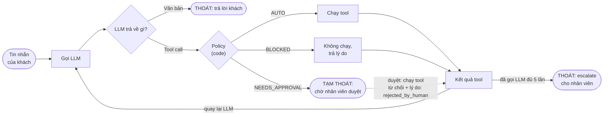

# Order Support Chatbot

Chatbot hỗ trợ đơn hàng mô phỏng một sàn thương mại điện tử (Python + FastAPI + Gemini API). Agent nhận câu hỏi về đơn hàng và tự tra cứu thông tin; **hoàn tiền và hoàn hàng luôn cần nhân viên duyệt trước khi chạy, bất kể số tiền; huỷ đơn chỉ tự chạy khi đơn còn `processing` (chưa đẩy hàng đi), đơn `shipped` thì cần duyệt**; yêu cầu vượt quyền thì escalate cho người. Có REST API và một giao diện chat tối giản (nền đen) chạy trên trình duyệt.

## Cài đặt

Yêu cầu: Python 3.10 trở lên và một Gemini API key.

**1. Tạo và kích hoạt môi trường ảo**

```powershell
# Windows (PowerShell)
python -m venv .venv
.venv\Scripts\Activate.ps1
```

```bash
# macOS / Linux
python3 -m venv .venv
source .venv/bin/activate
```

> Nếu máy có nhiều bản Python và `python` trỏ nhầm sang bản khác (ví dụ bản đi kèm LibreOffice), hãy dùng `py -3 -m venv .venv` trên Windows. Sau khi kích hoạt venv, `python` sẽ luôn là bản trong `.venv`.

**2. Cài thư viện**

```bash
pip install -r requirements.txt
```

**3. Tạo file `.env` và điền biến môi trường**

```powershell
# Windows (PowerShell)
Copy-Item .env.example .env
```

```bash
# macOS / Linux
cp .env.example .env
```

Mở `.env` và cập nhật:

| Biến | Ý nghĩa |
|---|---|
| `GEMINI_API_KEY` | API key của bạn (lấy tại Google AI Studio). **Bắt buộc.** |
| `GEMINI_MODEL` | Tên model Gemini. Mặc định `gemini-3.5-flash-lite`. |
| `HOST`, `PORT` | Địa chỉ và cổng của server. Mặc định `localhost:8000` (nghe cả IPv4 `127.0.0.1` và IPv6 `::1`, chỉ trong máy). Không bắt buộc. |

File `.env` đã nằm trong `.gitignore`, không commit key lên git.

## Cách chạy

```bash
python src/main.py
```

Chạy từ thư mục gốc của project (nơi có `.env`) sau khi đã kích hoạt venv, rồi mở http://127.0.0.1:8000.

- Giao diện chat: `http://127.0.0.1:8000/`
- Tài liệu API tương tác (Swagger): `http://127.0.0.1:8000/docs`

## Architecture




### Mức quyết định của guardrail

| Tool | Điều kiện | Mức |
|---|---|---|
| `get_order` | Chỉ đọc | AUTO |
| `cancel_order` | Đơn `processing` (chưa đẩy hàng đi) | **AUTO** (chạy ngay) |
| | Đơn `shipped` (đã đẩy hàng đi) | **NEEDS_APPROVAL** (luôn cần duyệt) |
| | Đơn `delivered` / `cancelled` / `returned` (hoặc mã đơn sai) | BLOCKED (đơn `delivered` đủ điều kiện thì lý do kèm gợi ý hoàn hàng) |
| `issue_refund` | Đơn đã thanh toán, số tiền hợp lệ và không vượt số còn hoàn được | **NEEDS_APPROVAL** (luôn cần duyệt, bất kể số tiền) |
| | Chưa thanh toán / số tiền ≤ 0 / vượt số tiền còn hoàn được / mã đơn sai | BLOCKED |
| `escalate_to_human` | Luôn cho phép | AUTO |
| `return_order` (nội bộ, không khai báo cho LLM) | Đơn `delivered`, đã thanh toán, còn số tiền hoàn được | **NEEDS_APPROVAL** (luôn cần duyệt) |
| | Đơn không `delivered`, chưa thanh toán, đã hoàn hết, hoặc mã đơn sai | BLOCKED |

**Quy tắc cốt lõi: không có đường tự động cho thao tác chuyển tiền.** Hoàn tiền và hoàn hàng (kéo theo hoàn tiền) luôn qua nhân viên duyệt, không phụ thuộc trạng thái đơn hay số tiền. Huỷ đơn `processing` tự chạy vì chưa đẩy hàng đi và không kèm hoàn tiền; huỷ đơn `shipped` vẫn cần duyệt. Ngoài ra chỉ tra cứu và escalate chạy tự động. `BLOCKED` áp dụng cho yêu cầu không thể thực hiện, nên không hỏi nhân viên.

### Luật phát hiện vấn đề (`detect_issues`)

`get_order` trả kèm danh sách vấn đề của đơn để agent tham khảo: `payment_failed` (thanh toán lỗi), `missing_address` (thiếu địa chỉ), `late_delivery` (quá hạn giao mà chưa giao), `high_value_pending` (đơn có tổng trên 500, ở mọi trạng thái đơn).

## Key design decisions

1. **Guardrail nằm trong code, không nằm trong prompt.** Prompt chỉ dặn Gemini cách cư xử, nhưng quyền chạy một hành động do `src/policy.py` quyết định dựa trên dữ liệu thật của đơn. Gemini không thể lách bằng cách diễn đạt khác, và khách nói gì cũng không đổi được kết quả.
2. **Tự điều khiển vòng lặp tool-calling.** Tắt automatic function calling của SDK để chèn policy và bước duyệt vào giữa "Gemini đề xuất" và "tool chạy".
3. **Mọi thao tác chuyển tiền luôn cần người duyệt.** Hoàn tiền và hoàn hàng không có ngưỡng và không có đường tự động; huỷ đơn chỉ tự chạy khi đơn còn `processing`, đơn `shipped` cần duyệt. Ngoài ra chỉ tra cứu và escalate tự chạy. Tổng tiền đã hoàn của đơn vẫn được tính để chặn hoàn vượt số tiền của đơn.
4. **Mỗi phiên xử lý một lượt tại một thời điểm.** Gửi tin khi phiên đang bận hoặc đang chờ duyệt trả `409`, để lịch sử hội thoại không bị ghi chồng.
5. **Giới hạn 5 lượt gọi Gemini mỗi tin nhắn.** Vượt thì dừng và tự escalate để tránh vòng lặp vô hạn.
6. **Ngày "hôm nay" cố định** (`policy.TODAY = 2026-10-07`) để dữ liệu mẫu cho kết quả `late_delivery` giống nhau mỗi lần demo.

## Known limitations

1. **Không dùng dữ liệu thật.** Dữ liệu là 9 đơn mẫu trong `data/orders.json`, chỉ lưu trong bộ nhớ: mỗi phiên có bản sao riêng, mất khi server khởi động lại, server giữ tối đa 200 phiên gần nhất và chạy một process. Chưa có xác thực khách hàng hay nhân viên: ai biết mã đơn đều thao tác được đơn đó, và ai cũng gọi được `/approval`.
2. **Chưa có kiến thức chuyên sâu về domain đơn hàng và vận hành, nên các hành động cuối chỉ là giả lập.** Hoàn tiền không gọi cổng thanh toán, `escalate_to_human` chỉ in ra console. Hoàn hàng chỉ nhập tay video (không upload, không kiểm tra), duyệt là đổi đơn sang `returned` và hoàn toàn bộ số tiền còn lại, không hoàn một phần, không có thời hạn hoàn hàng. Huỷ đơn không tự hoàn tiền. Luật nghiệp vụ là hằng số trong `src/policy.py` (ví dụ ngưỡng 500 chỉ để gắn cờ cảnh báo), chưa cấu hình được từ ngoài. Lượt lỗi không hoàn tác tool đã chạy: nếu tool đã thực thi rồi Gemini mới lỗi thì lịch sử được khôi phục nhưng thay đổi dữ liệu vẫn còn.
3. **Phụ thuộc vào Gemini.** Chỉ dùng một model Gemini, cần mạng và API key hợp lệ. Khi API lỗi hoặc quá tải thì lượt đó chỉ trả thông báo lỗi; thực tế cần một lớp router để chuyển sang LLM khác khi Gemini không dùng được. Chất lượng câu trả lời và việc tuân thủ định dạng 3 dòng cuối phụ thuộc model (guardrail vẫn an toàn dù model trả lời sai định dạng), chưa kiểm thử với nhiều model, và chưa có cơ chế chống prompt injection riêng (guardrail vẫn chặn được hành động nhạy cảm nhưng agent có thể bị dẫn dắt trả lời lạc đề).
4. **Chưa có test tự động trong repo.**
